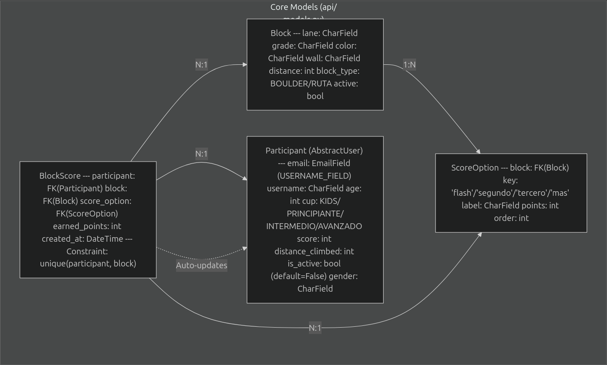
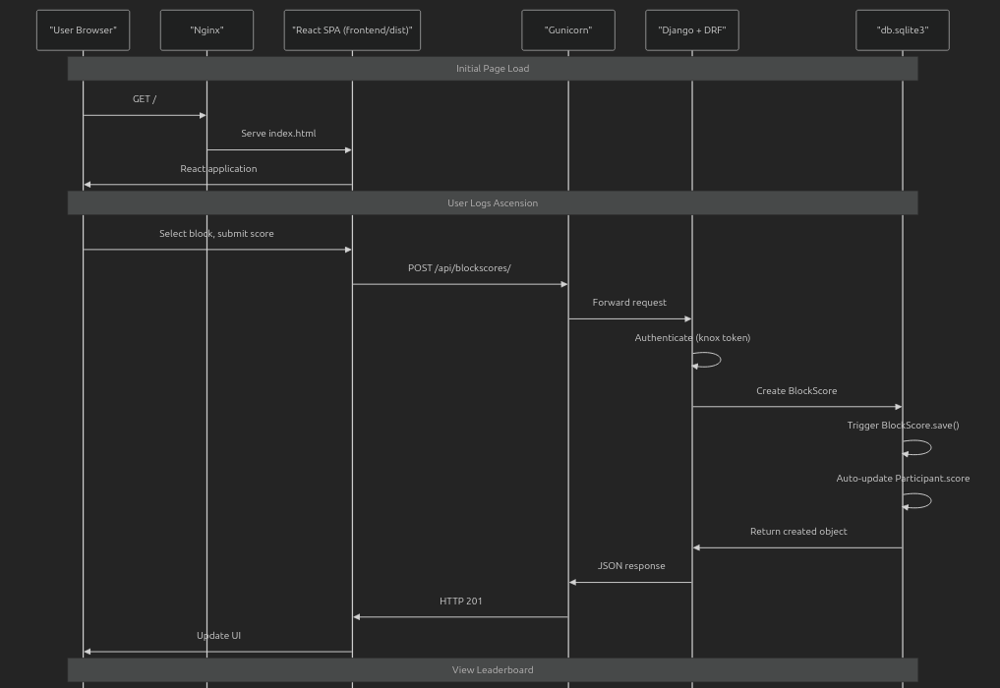
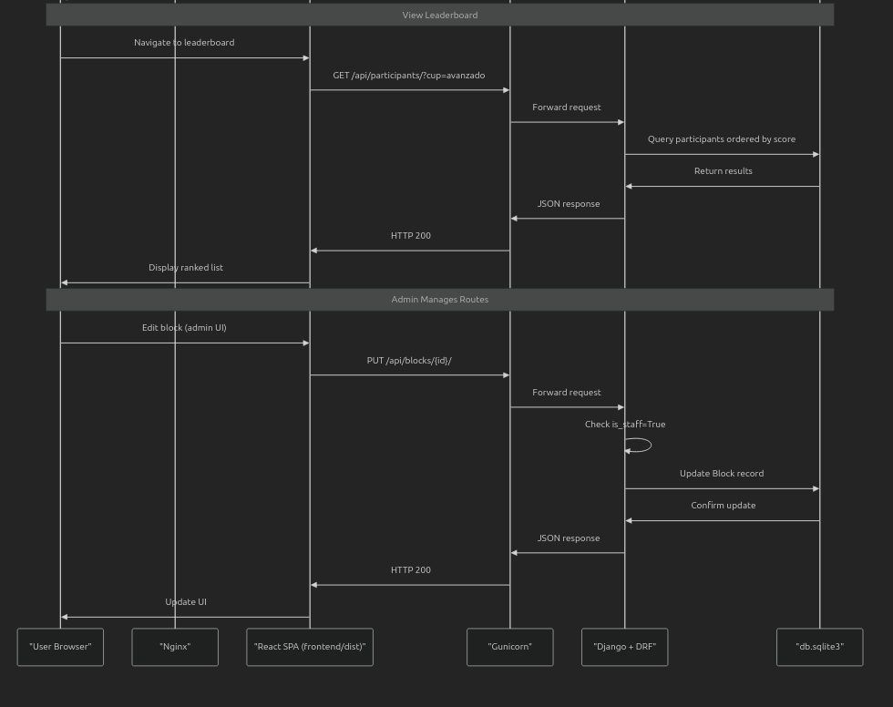
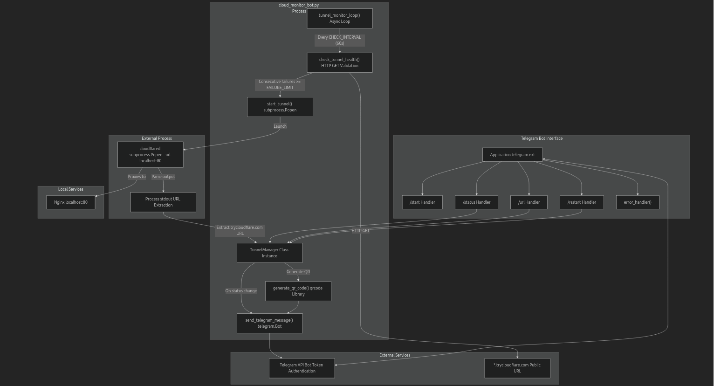
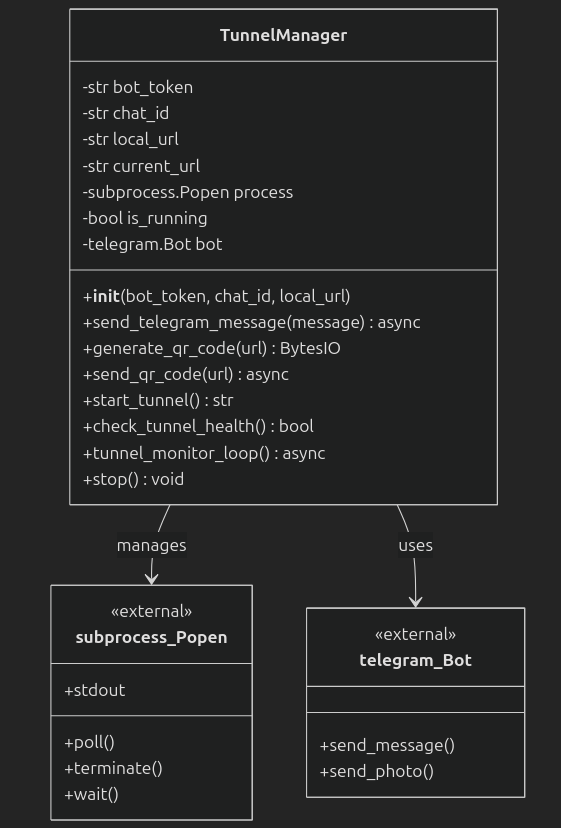
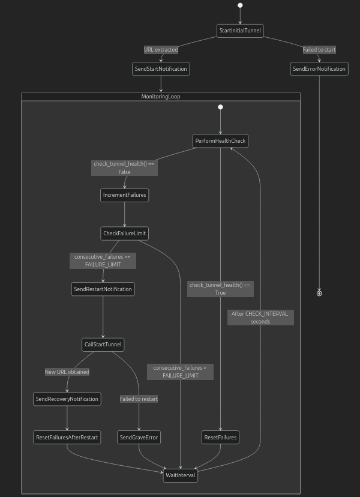

# iRock App (Beta)

## Core Problem

Traditionally, climbing competitions rely on paper scorecards and manual data entry. Staff members must collect physical sheets and transcribe scores into Excel macros one by one. This manual process is:
* **Tedious and slow:** Creating bottlenecks during the event.
* **Prone to errors:** Handwriting can lead to misunderstandings and incorrect scoring.
* **Ephemeral:** There are no persistent records of past competitions, making it impossible to track historical data (max scores, participant averages, progress) over time.

**iRock App** was built to modernize this workflow, ensuring data integrity and real-time results.

## What is iRock?

iRock is a web application designed to manage climbing competitions (both Boulder and Route/Lead). It streamlines the event lifecycle by allowing:

* **Organizers:** To define climbing blocks (routes/boulders) with specific difficulty grades, scoring rules (Flash, Top, Zone), and categories.
* **Participants:** To register, log their own ascents in real-time via mobile, and view live performance on leaderboards.
* **Administrators:** To manage the user lifecycle, approve registrations, and visualize competition statistics.

**Security Workflow:** The system enforces a strict activation workflow. New users can create an account, but cannot participate or submit scores until an administrator validates their payment/entry fee. This ensures only authorized contestants can compete.

## System Design

### Functional Requirements
1.  **User Management:** Registration and authentication system.
2.  **Ascent Logging:** Users must be able to submit an ascent (recording the block sent and the attempt type).
3.  **Stats & History:** Users can view their own performance metrics.
4.  **Access Control:** Staff must verify payments and manually activate/deactivate accounts.
5.  **CRUD Operations:** Staff can manage users, blocks (routes), and scoring rules.
6.  **Leaderboards:** Real-time ranking generation based on categories.

### Non-Functional Requirements & Constraints
* **Availability:** High availability is critical *during* the tournament window (approx. 4-8 hours), with relaxed requirements outside competition times.
* **Consistency:** Strict prevention of duplicate scores (idempotency).
* **Latency:** Asynchronous writes are acceptable; slight delays in leaderboard updates are tolerated in favor of data integrity.
* **Scalability:** Designed for gym-level events (target: <100 Daily Active Users), removing the need for complex distributed systems.

### Core Entities
* **User:** Represents both Contestants and Staff.
* **Block:** Represents a specific route or boulder problem.
* **Ascension:** The event of a user successfully climbing a block.
* **BlockScore:** The specific point value assigned to a block based on the attempt type.

### High-Level Architecture

### Data Model

| Model | Purpose | Key Fields | Relationships |
| :--- | :--- | :--- | :--- |
| **Block** | Defines a climbing route or boulder. | `lane`, `grade`, `block_type`, `distance` | Has many `ScoreOption`. |
| **ScoreOption** | Defines scoring for a block by attempt count. | `key` (e.g., flash), `points` | Belongs to `Block`. |
| **Participant** | Represents a competition participant. | `email` (username), `cup` (category), `score`, `is_active` | Has many `BlockScore`. |
| **BlockScore** | Records a participant's ascension. | `earned_points`, `participant_id`, `block_id` | Links `Participant` & `Block`. |

## Tech Stack

### Backend
* **Django:** Core framework for ORM, Admin Interface, and business logic.
* **Django REST Framework:** RESTful API endpoints.
* **Knox:** Robust, token-based authentication.
* **SQLite:** Database (Optimized for read-heavy, low-concurrency event scale).
* **Gunicorn:** WSGI Production Server.
* **WhiteNoise:** Static file serving.

### Frontend
* **React & Vite:** Fast, component-based UI.
* **Material-UI (MUI):** Responsive design system.
* **Client-side Routing:** SPA architecture.

### Infrastructure & DevOps
* **Nginx:** Reverse proxy and security layer.
* **Systemd:** Process management for Gunicorn persistence.
* **Cloudflare Tunnel:** Exposes the local server securely to the internet without port forwarding.
* **UFW:** Firewall configuration.
* **QR Generation:** Quick access for gym users.

## Request Flow

The following diagram illustrates how requests flow through the system for both user and admin operations:

## Infrastructure Considerations & Automation

This system operates on a **zero-budget infrastructure**. It is hosted on a local server rather than a cloud provider. To make the local server accessible publicly without risky port forwarding, a **Cloudflare Tunnel** is utilized.

**The Challenge:** The free tier tunnel service can occasionally disconnect or require restarts.
**The Solution:** A custom Python automation bot (`TunnelManager`) was implemented to ensure ~90% uptime during the event (THIS IS OKAY, users are not intended to submit every sec, 1 sumbit each 5 mins avg).

### Tunnel Manager Bot (Telegram)
Encapsulates tunnel lifecycle management, health monitoring, and alerting.
* **Health Check:** A continuous loop pings the service.
* **Auto-Healing:** If the tunnel goes down, the script restarts the process automatically.
* **Alerting:** Sends real-time logs and new URL generation status to admins via a Telegram Bot.

Here is the class diagram

and the UML for better visulization of bot lifecycle

## Conclusions

The iRock App was successfully deployed and battle-tested during the **"Rocódromo Fusión iRock Event"**.

The system completely eliminated the need for paper scorecards, handling the entire competition workflow digitally. Staff reported a **~99% reduction in data entry time** (before it took about 3/4 hours to introduce the data, now is done by user), and misunderstandings regarding scores were virtually eliminated. Participants praised the ability to see live rankings, which increased engagement and competitiveness during the event. The hybrid infrastructure (Local Server + Cloudflare + Telegram Bot) proved to be resilient, maintaining uptime throughout the competition with zero cost.

## Future Iterations

* **Pivot to Community App:** Transition from a "tournament-only" focus to a continuous "Climber's Logbook" app.
* **Gym Integration:** Allow climbers to register daily gym ascensions to track long-term progress.
* **Social Features:** Share ascents and gym stats.
